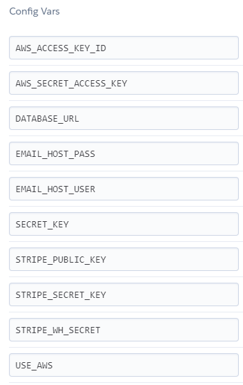
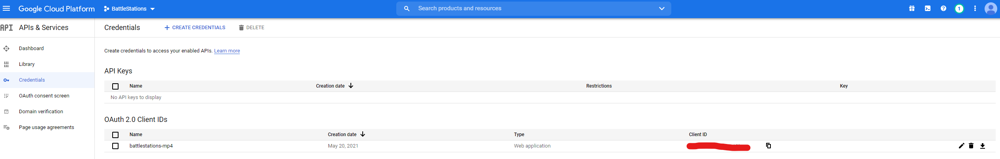
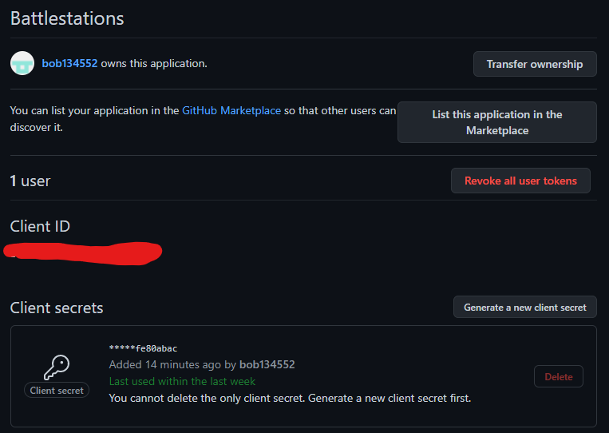

# BattleStations

## Contents
1. [**UX**](#ux)
    - [**User Stories**](#user-stories)
    - [**Design**](#design)
    - [**Wireframe Mockups**](#wireframe-mockups)
2. [**Features**](#features)
    - [**Existing Features**](#existing-features)
    - [**Features to add in the future**](#features-to-add-in-the-future)
3. [**Database and Database Models**](#database-and-database-models)
    - [**Database Models**](#models)
4. [**Technologies Used**](#technologies-used-frameworks-libraries-languages-and-programs-used)
5. [**Testing**](#testing)
6. [**Deployment**](#deployment)
7. [**Credits**](#credits)
    - [**Code**](#code)
    - [**Media and Content**](#media-and-content)
    - [**Acknowledgements**](#acknowledgements)

---

## Milestone Project 4 - Full Stack Development

## Bobby Jackson


The live site can be found [here](https://battlestations-mp4.herokuapp.com/).

A site designed to allow users to view and purchase computer components, pre-built desktops or create their own custom
build from the parts provided within the store.
The website contains products recently released and aims to keep up to date with all recent releases of PC parts. 
The website features a catalogue of recently released products, user registration including social media integration 
and email authentication and the ability to create your own custom desktop PC.
The primary goal of the website is to create a easy platform for users to browse, buy and comment on products available
on the site. 

---

## UX

The ideal user for this site is:
- Interested in either building or purchasing desktops, or purchasing components for their own builds.
- Interested in leaving their thoughts on products to help other users.
- English speaking.

Visitors to the site are looking for:
- Other users thoughts on products being sold on the site.
- The ability to purchase any available product on the site.
- The ability to create personal PC builds based on items within the store. 

The website should be:
- Easy to navigate.
- Have a simple registration and log in with the possibility of using a social account for log in.
- Able to search through a database of PC components to find specific ones.
- Able to add or remove products as required.

<a href="#contents">Back To Top</a>

---

## User Stories

#### New User

1. As a new visitor, I want to be able to navigate the site with ease.
2. As a new visitor, I want to be able to use the site before registering and be able to purchase products without signing up. 
3. As a new visitor, I want to be able to sign up easily.

#### Returning User

1. As a returning user, I want to be able to quickly purchase any product I may need.
2. As a returning user, I want to be able to edit my details should they change.
3. As a returning user, I want to be able to leave a review on the site based on my order experience.
4. As a returning user, I wish to be able to leave comments on the products I've purchased and view other users opinions too.

#### Site Admin

1. As a site admin, I want to be able to edit or delete other user comments and reviews should they contain anything inappropriate.
2. As a site admin, I want to be able to manage items within the store be it adding, updating or deleting.

### Design

- Colour Scheme

    From researching designs of other PC building/parts selling sites, the colour scheme of orange-yellow and black was chosen to give a sharper,
    minamalistic look.

- Imagery

    The images used in the site are all products for sale to the user and to allow them to get an idea of what they are buying.

- Font

    The font was chosen as it gave a sharper feel to the overall minamalistic style of the site.

<a href="#contents">Back To Top</a>

---

### Wireframe Mockups

The wireframes were created using Balsamiq during the initial design and planning phase for this project. 
The wireframes plan for this project can be found in my github repository:

- Site Map - [View](https://github.com/bob134552/Battlestations/tree/master/wireframes/site-map.pdf)
- Deskop Wireframe - [View](https://github.com/bob134552/Battlestations/tree/master/wireframes/desktop-wf.pdf)
- Mobile Wireframe - [View](https://github.com/bob134552/Battlestations/tree/master/wireframes/mobile-wf.pdf)

<a href="#contents">Back To Top</a>

---

## Features

### Existing Features

#### Navbar

The navbar is available throughout the site as a means for the user to be able to search the site through the available search bar, access their basket
and the user's personal profile page. Users are also able to move through the site using the navigation links available to them. The navbar is 
responsive and will collapse on smaller screens.

#### Footer

Contains social media links to Facebook, Google and Instagram. The footer also contains contact details and a privacy policy.

#### Home Page

The Home page features a carousel featuring recent pre-built PCs available for purchase, a section allowing users to choose a category to view,
and a site review section where the four most recent reviews are visible for new or returning users to view. The site reviews section also allows 
a logged in user be able to write their own review and give a star rating which adds to the average rating above the reviews.

#### Site Review Page (add and update)

The Site Review page is a form consisting of a radio button star rating and a text field for users to write their review of the site. The update page is the same
but prefilled with the users initial review. There are two buttons available to the user, a home button should they wish to not submit or edit their review 
and a submit button to save their review.

#### Profile Page

The Profile page is accessible from the profile option in the navbar, it features a form of the users previously saved delivery details, an order
history that they can click on to view previous orders and three buttons that bring them to the email management, password change and social account 
management pages.

#### Email Management page

The Email Management page allows users to select a primary email to be used, add/remove and verify additional emails if required, or change their primary email
address.

#### Password Change page

The Password Change page allows the user to enter their old password and new password twice in order to change their current password.

#### Social Accounts page

The Social Accounts page allows users to manage their social connections and connect or remove their Facebook, GitHub and Google accounts to their profile.

#### Sign up

The Sign Up page consists of a form to gather a users email, desired username and password in order to allow them to register for an account. Alternatively
there is a link that redirects to the log in page so they can log in with a social account.

#### Login Page

The Login page contains a simple form that requires two inputs; username and password.
A submit button below the form takes the user back to the home page, if the login details are entered correctly.
If the details are incorrect the user is informed that either the username/password was incorrect. 
There is a link to the sign up page, three social buttons (Facebook, GitHub and Google) that allow a user to login with a social account and a link to the 
password reset page that allows users to reset their password through email.

#### All Products page

The All Products page displays a list of all available products to the user, excluding Pre-built PCs. The user is able to see core information on each product and add a specified quantity 
of the product to the basket. The use can sort the products by name, price and category in either ascending or descending order. Through the dropdown in the navbar
the user is able to search a specific category (such as cooling, cpus etc.)

### Product Details page

The Product Details page is a page to display all details of a selected product should a user wish to know more. There is a quantity and add to basket button available for the user
should they wish to purchase the product that they are viewing. A comment section is also available for each product should users wish to leave messages regarding the product
or ask questions.

#### Build a PC page

The Build a PC page consists of a form containing dropdowns for each component category. 
The user then picks a product in each category to create their own unique PC build.

####  Search Page

The Search page is used to display user queries through the use of the search bar. If no results are returned the user is notified and there is a link to go back to 
all products.

#### Basket Page

The Basket page displays all current items in the users basket and allows them to either remove or update the quantity of each item in the basket. The final costs 
are also displayed to the user. If there are no items in the users basket the user is notified that the basket is empty and given a button to go back to the products
should they wish to add anything to their basket.

#### Checkout Page

The Checkout page cosists of a form asking the user for delivery details, Stripe card payment input and a card featuring the users order summary.
On submit of an order the page is overlayed with a loading spinner until the payment intent webhook from stripe is received and the user is then redirected to the
checkout success page for their order.

#### Checkout Success/Order History page

The Checkout Success page is displayed after a successful purchase. The order history page is displayed when checking your purchase from the profile page.
Both pages contain similar information such as order summary and delivery details. One of the notable differences is that the order history page contains a
button back to the profile page.

#### Other Existing Features

- Comment section for products.
- Social account login.
- Stripe Payment handling.
- Build a custom PC.
- Site reviews.
- Site management for admins.

### Features to add in the future

- The ability to edit custom builds instead of restarting the build.
- The ability to edit pre built PCs if required.
- The ability to give thumbs up/down to products and comments using Facebook like system.
- A chat box for visitors so they can talk about upcoming releases and keep site traffic up.
- Paypal payment.
- A way to disable options for parts if they are not compatible with ones that are currently selected.

<a href="#contents">Back To Top</a>

---

## Database and Database Models

The database used was Postgres, which was installed through Heroku. Throughout production, SQLite3 database was used.
During the creation of each app and creation/update of models the python3 manage.py makemigrations and python3 manage.py migrate was ran to modify or create each model. 

### Models

#### Category Model

|Name|Key|Description|Field Type|
|:---|:----:|:----:|---:|
|Name|name|max_length=254|Charfield|
|Friendly Name|friendly_name|models.CharField(max_length=254, null=True, blank=True)|Charfield|

#### Product Model

|Name|Key|Description|Field Type|
|:---|:----:|:----:|---:|
|Category|category|'Category', null=True, blank=True, on_delete=models.SET_NULL|ForeignKey|
|Sku|sku|max_length=254, null=True, blank=True|Charfield|
|Name|name|max_length=254|Charfield|
|Info|info|max_length=2048, null=True, blank=True|CharField|
|Description|description|blank|TextField|
|Price|price|max_digits=6, decimal_places=2|DecimalField|
|Image Url|image_url|max_length=1024, null=True, blank=True|UrlField|
|Image|image|null=True, blank=True|Image Field|
|In Stock|in_stock|default=True, null=False|BooleanField|

#### Order Model

|Name|Key|Description|Field Type|
|:---|:----:|:----:|---:|
|Order Number|order_number|max_length=32, null=False, editable=False|CharField|
|User Profile|user_profile|UserProfile, on_delete=models.SET_NULL, null=True, blank=True, related_name='orders'|ForeignKey|
|Full Name|full_name|max_length=50, null=False, blank=False|Charfield|
|Email|email|max_length=254, null=False, blank=False|EmailField|
|Phone Number|phone_number|max_length=20, null=False, blank=False|Charfield|
|Country|country|blank_label='Country *', null=False, blank=False|CoutryField|
|Postcode|postcode|max_length=20, null=False, blank=False|Charfield|
|Town or City|town_or_city|max_length=40, null=False, blank=False|Charfield|
|Street Address 1|street_address1|max_length=80, null=False, blank=False|Charfield|
|Street Address 2|street_address2|max_length=80, null=True, blank=True|Charfield|
|County|county|max_length=80, null=True, blank=True|Charfield|
|Date|date|auto_now_add=True| DateTimeField|
|Delivery Cost|delivery_cost|max_digits=6, decimal_places=2, null=False, default=0|DecimalField|
|Order Total|order_total|max_digits=10, decimal_places=2, null=False, default=0|DecimalField|
|Final Amount|final_amount|max_digits=10, decimal_places=2, null=False, default=0	|DecimalField|
|Original Basket|original_basket|null=False, blank=False, default=''|TextField|
|Stripe PID|stripe_pid|max_length=254, null=False, blank=False, default=''|Charfield|

#### Order Line Item Model

|Name|Key|Description|Field Type|
|:---|:----:|:----:|---:|
|Order|order|Order, null=False, blank=False, on_delete=models.CASCADE,related_name='lineitems'|ForeignKey|
|Product|product|Product, null=False, blank=False, on_delete=models.CASCADE|ForeignKey|
|Quantity|quantity|null=False, blank=False, default=0 |IntegerField|
|Line Item Total|lineitem_total|max_digits=6, decimal_places=2, null=False, blank=False, editable=False|Decimal Field|

#### Site Review Model

|Name|Key|Description|Field Type|
|:---|:----:|:----:|---:|
|User|user|User, on_delete=models.SET_NULL, null=True|OneToOneField|
|Rating|rating|choices=CHOICES, default=1, null=False|IntegerField|
|Review|review|null=False|TextField|
|Date|date|auto_now_add=True, null=False|DateTimeField|

#### Comment Model

|Name|Key|Description|Field Type|
|:---|:----:|:----:|---:|
|Product|product|Product, on_delete=models.CASCADE, related_name='comments'|ForeignKey|
|Username|username|max_length=80, null=True, blank=True|CharField|
|Body|body|blank|TextField|
|Created|created|auto_now_add=True|DateTimeField|

<a href="#contents">Back To Top</a>

---

## Technologies used (Frameworks, Libraries, Languages and Programs used)

- [HTML5](https://en.wikipedia.org/wiki/HTML)
    - To structure the content on each page of the site.
- [CSS](https://en.wikipedia.org/wiki/CSS)
    - To style the site in order to make it more appealing to the user.
- [JavaScript](https://en.wikipedia.org/wiki/JavaScript)
    - To initialise some bootstrap5 elements and write custom functions to the site.
- [Python](https://en.wikipedia.org/wiki/Python_(programming_language))
    - To write and handle back end functions for the site.
- [Django](https://www.djangoproject.com/)
    - To allow for easier creation of the site.
- [jQuery](https://en.wikipedia.org/wiki/JQuery)
    - Allows for easier DOM manipulation.
- [Bootstrap5](https://getbootstrap.com/)
    - To make a responsive mobile first site and allow for a simpler structure.
- [Heroku](https://www.heroku.com/)
    - Used for deploying and managing the project.
    - Postgres database used outside of developement.
- [Balsamiq](https://balsamiq.com/)
    - Used to design the wireframe of the project during the design process.
- [GitHub](https://github.com/)
    - Used to store the projects code.
- [GitPod](https://www.gitpod.io/)
    - IDE used to build the site.
- [Amazon Web Services](https://aws.amazon.com/)
    - Used to store static and media files through S3
- [Stripe](https://stripe.com/en-gb)
    - Handles card payments.
- [Facebook Developers](https://developers.facebook.com/?no_redirect=1)
    - To allow Facebook log in to the site.
- [Google Developers](https://developers.google.com/)
    - To send verification and checkout success emails through Google and allow log in with a Google account.
- [GitHub OAuth Application](https://github.com/settings/applications/new)
    - To allow log in with GitHub account.
- [SQLite3](https://www.sqlite.org/index.html)
    - For database management during developement.
- [Tailor Brands](https://www.tailorbrands.com/)
    - For brand logo design.
- [Google Fonts](https://fonts.google.com/)
    - To apply a different font to the site than the standard font.
- [Privacy Policies](https://app.privacypolicies.com/)
    - To create a privacy policy required for Facebook login.

<a href="#contents">Back To Top</a>

---

## Testing

Testing can be found in [TESTING.md](https://github.com/bob134552/Battlestations/blob/master/TESTING.md)

<a href="#contents">Back To Top</a>

---

## Deployment

The project was developed using Gitpod IDE. It was committed and pushed to GitHub through the use of git using the functions in Gitpod.

It was then deployed on Heroku by connecting the GitHub repository to the Heroku app.

To deploy the app on Heroku, first clone the repository.

To Clone the repository:
1. Log into GitHub.
2. Install [Gitpod](https://www.gitpod.io/)
3. Select the [Battlestations repository](https://github.com/bob134552/Battlestations) from the list of repositories.
4. At the top of the page click the drop down button with "code". 

5. Copy the HTTPS link provided.
6. Open your IDE and change the current directory to the location where you want the cloned directory to be.
7. Type ```git clone``` and paste the copied HTTPS link after.

    Example:

    ```git clone https://github.com/YOUR-USERNAME/YOUR-REPOSITORY```

8. Hit Enter and your clone of the repository will be made.

If any problems occur refer [here](https://docs.github.com/en/github/creating-cloning-and-archiving-repositories/cloning-a-repository) for help.

To deploy on Heroku.

1. Log into Heroku.
2. Click on "New" button and "Create new app" on the drop down.
3. Write your apps name and select a region close to you.
4. From the app page select "Deploy" and connect to the GitHub cloned repository from before.
5. For the app to work there are a few settings required, Select the "Settings" tab.
6. Click Reveal Config Vars to show them.



7. Once filled in you can then return to the "Deploy" tab and scroll to the bottom and click "Deploy branch".

Your app should be deployed and a link will be available to view it.

Depending on the database you use you will need to follow some extra steps.

### Notes:

For enabling Facebook social login it is required to go to the [Facebook developer page](https://developers.facebook.com/).  
Creating an app and heading to the settings page to acquire the app ID and secret required.


On the Django admin, navigate to the "Social Applications" admin and click "ADD SOCIAL APPLICATION".


Input the app ID and Secret into the respective fields and set your site as the chosen site.

Similary, for allowing Google or Github social account log in, create an app for your site through the Google Developers and create
credentials for OAuth 2.0 Client IDs. You will be given a client ID and secret which similar to Facebook set up,
enables Google log in.


For GitHub, going to the settings page and clicking applications allows users to create an OAuth app to allow for log in to the site.



- For Facebook to allow log in it is required to have a Privacy Policy Page and information on how to remove app connection.

<a href="#contents">Back To Top</a>

---

## Credits

### Code

- [This](https://stackoverflow.com/questions/40870635/star-rating-system-html) post on stackoverflow to work out how to make a star rating.
- [This](https://codinhood.com/micro/10-dropdown-menu-animations-css-transform) post to animate the dropdown for products.
- [This](https://1stwebdesigner.com/pure-css-animated-page-loaders/) for the hexagon loading overlay during checkout.
- The Boutique Ado tutorials by Chris Zielinski, which helped tremendously throughtout development of this site.

### Media and Content

- Most product images and details taken from [Scan](https://www.scan.co.uk/)
- 2 products taken from [DinoPC](https://www.dinopc.com/)

### Acknowledgements

- My family, especially my grandad Gordon. This would not have been possible without them. 
- My wife and daughter for the daily support throughout the course.
- My mentor for all the support, ideas and guidance.

<a href="#contents">Back To Top</a>

---