Expanded from [README.md](https://github.com/bob134552/Battlestations/blob/master/README.md)

# Testing section

The site was tested on desktop using Google Chrome's developer tools.
It was also tested on several devices: Samsung Galaxy S10+, iPhone 12, Samsung Tab A and iPhone 11.

[W3C CSS Validator](https://jigsaw.w3.org/css-validator/) was used to ensure there was no errors in CSS files.  
[W3C HTML Validator](https://validator.w3.org/) was used to check for errors in all templates, any error left is due to django templating.
[BeautifyTools](https://beautifytools.com/javascript-validator.php) was used to validate all written javascript.
[PEP8 online check](http://pep8online.com/) was used to check for errors in python code for all apps.
- Some errors remain due to length of lines, these were ignored as it was not possible to shorten them.

### Manual Testing Based On User Stories

#### New User

1. As a new visitor, I want to be able to navigate the site with ease.

    Navbar:

    - The navbar is always available to the user throughout the site.
        - Clicking on the brand logo of the site (available on large screens) or on the home link brings the user to the front page of the site.
    - Clicking on the dropdown for products allows the user to view either all products or a specified category.
    - Clicking on the Pre-Built nav link filters to show only pre-built PCs.
    - Clicking on the Build a PC nav link takes the user to a form where they are able to pick PC components for a personal custom build.
    - Clicking on the My Profile drop down gives users the option to sign up or login if the user isn't logged in.
        - If the user is logged in they are given the option to view their own profile and log out.
        - If the user is a site admin they are able to access product management.

2. As a new visitor, I want to be able to use the site before registering and be able to purchase products without signing up.

    - All features of the site are available to the user except for being able to leave a review or comment on products.
    - A new user is able to purchase products without signing up and able to see order summary through the link provided in the confirmation email sent after purchase.

3. As a new visitor, I want to be able to sign up easily.

    Sign up and log in page:

    - The sign up page is easy to access and is available through the "My Profile" dropdown on the top right of the site.
        - Signing up is simple to do and only requires a username, email and password.
        - Attempting to sign up with an email that is being used by another user notifies the user and does not create the new account.
        
       
    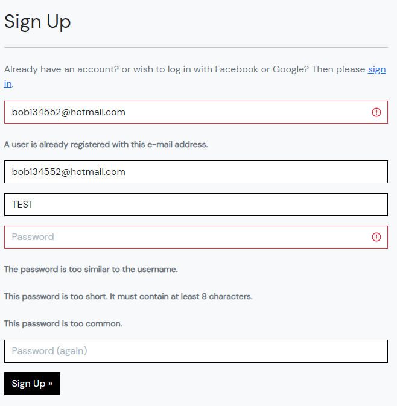
        
    - Alternatively if user wishes to log in with a social account the option is available on the log in page.
    
    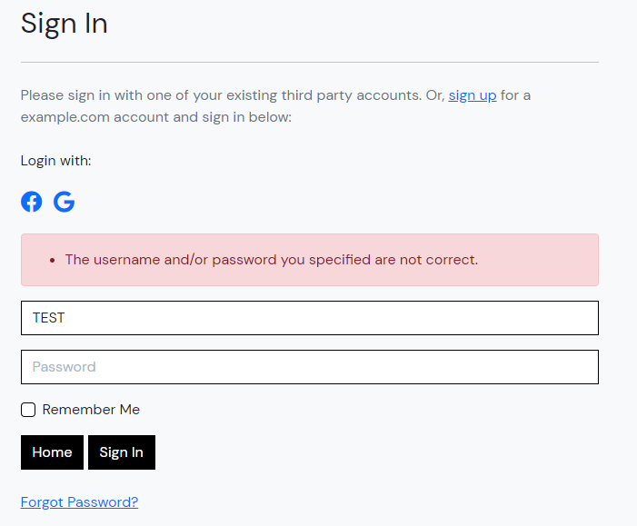

#### Returning User

1. As a returning user, I want to be able to quickly purchase any product I may need.

    Checkout Form:

    - User delivery information is stored and displayed on the user profile page.
    - Information is saved if the user specified for it to be saved during their first purchase on the checkout form.
    - Delivery information can be manually added by the user in the user's profile page.

2. As a returning user, I want to be able to edit my details should they change.

    User Profile Page:

    - Delivery details are available on the user's profile page and can be updated as needed.
    - Below the delivery details form there is options of change password, email and connect a social account to the user account.
    - Each form for change password and email is straight forward and easy to use.

3. As a returning user, I want to be able to leave a review on the site based on my order experience.
    
    Review Form:

    - At the bottom of the home page, users are able to leave one review should they wish. The review also includes a star rating they
        can select.
    - Users are able to edit/delete their review if their opinion changes in the future. 
    - Users are limited to one review per user to prevent multiple reviews from the same user.
    - Attempting to submit the review form with an empty text input or no star rating prompts the user that both are required.
    
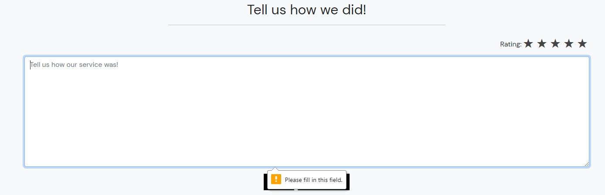

4. As a returning user, I wish to be able to leave comments on the products I've purchased and view other users opinions too.

    Product Details Comment Section:

    - Logged in users are able to submit as many comments as they wish on each product details page.
    - Most recent comments are shown at the top.
    - Submitting a blank comment notifies the user that there needs to be some input for a comment to be submitted.
    - Clicking on update allows the user to edit their comment and after submitting the update it is correctly displayed.
    - Deleting a comment removes it from the comment section.

#### Site Admin

1. As a site admin, I want to be able to edit or delete other user posts should they contain anything inappropriate.

    - For both the site review section on the home page and the comment section for each product, a site admin is given the 
        option to either delete or update another users review or comment.

2. As a site admin, I want to be able to manage products within the store be it adding, updating or deleting.

    Product Management Add/Update Form:

    - Attempting to access this page if user is not a site admin will return user to the login page.
    - The site admin is able to access both these pages, both are similar but the update page is prefilled with the selected products information.
    - Submitting the form without a required field informs the user.
    - Should the image for a product need to be changed, the file name for the new image is shown so that the user knows what its changing to.
    - Clicking remove on a product opens a modal asking the user if they are sure, in order to prevent accidental deletion of a product.

## Testing Elements on each page

### Home page

#### Navbar

- Clicking on the logo returns user to home page.
- Clicking on the home nav link takes user to home page.
- Clicking on the products dropdown gives users access to all products or a cetain category.
- Clicking on pre built PCs filters all products for pre built PCs.
- Clicking on Build a PC takes users to the build a PC page.
- Clicking on My Account presents the users options: different options are displayed depending on if they are logged in or not.
    - Sign up and log in when not logged in.
    - My profile and log out if logged in, with Product Management if user is admin.

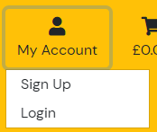
 
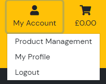

- Clicking on the basket takes the user to the basket page.

#### Carousel

- Clicking on the left or right button slides to the next or previous product.
- Clicking on the product image takes the user to the selected product's details page.

#### Site Review Section

- If not logged in user will be asked to log in or sign up.
- If user is logged in they are able to access the add/update review page.

### Products/Search page

- Clicking on a products image or name takes the user to the products detail page.

#### Search bar

- If no matches the user is shown there are no results.

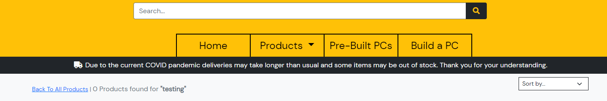

- If a search returns results, users are shown the results.

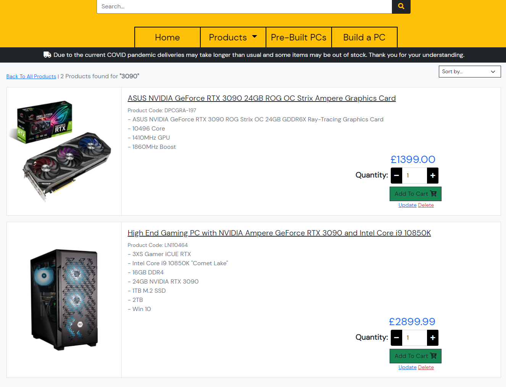

#### Sort dropdown

- Clicking on the sort by dropdown shows options to sort the products currently displayed.
- Clicking on Name(A-Z) or Name(Z-A) will sort products in ascending or descending order.
- Clicking on Category(A-Z) or Category(Z-A) will sort products into categories in ascending or descending order.
- Clicking on Price(low to high) or Price(high to low) will sort products in ascending or descending order based on cost.

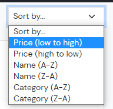

### Add to basket button and quantity selector (on multiple pages: products, search and product details page).

- Clicking the add to basket button adds the specified product and its quantity to the basket.
- Clicking on the plus or minus button on the quantity selector, increments or decrements the quantity value.
- Clicking on the add to basket button with a selected quantity adds that product and quantity to the basket.

### Basket Page

- Clicking on update changes the quantity of the selected product to the new quantity specified.
- Clicking on remove will remove the selected product from the basket.
    - Removing a custom built pc also deletes it from the database.
- Clicking on the products name takes the user to the details page for that product.

### Checkout page

- Filling the form out correctly and submitting takes users to checkout success page.
- Leaving a required field blank notifies the user of a missing field.
- Filling the card details input incorrectly notifies the user when they submit.
- Commenting out the form.submit() in the stripe_elements.js stops the user from being taken to the checkout success.
    - The order is still submitted as the webhook handler adds it to the database and sends a confirmation email to the user should the form fail.

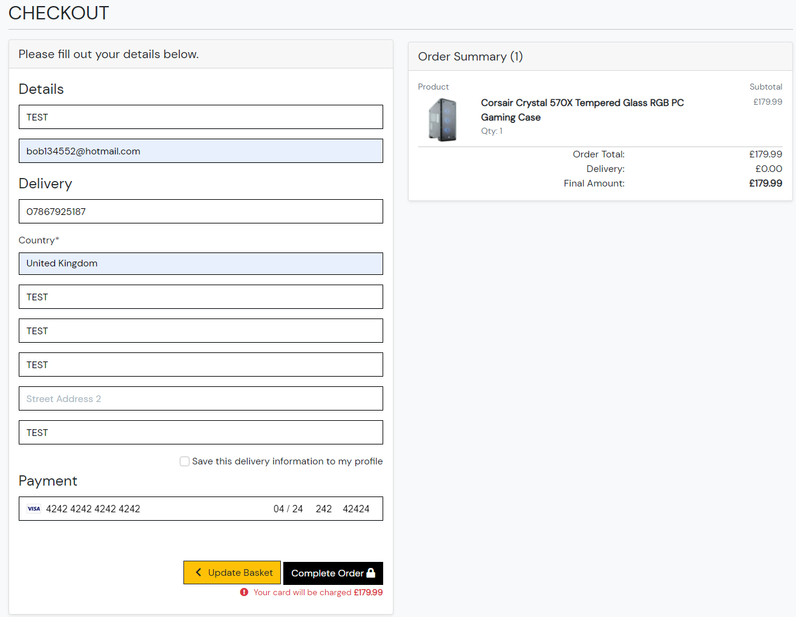

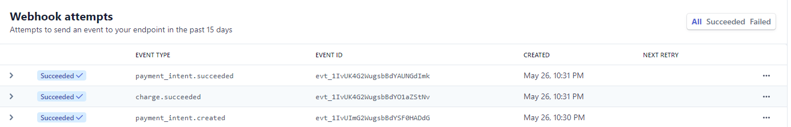

### Profile page

- Filling the delivery details and submitting adds or updates the details based on user input.
- Clicking on a order number (if available) takes the user to a page similar to the checkout success page that displays the users order details.

### Social connections page

- If connected to either Facebook, Google or GitHub there is a radio button displayed for each.
- Selecting either of the radio buttons and clicking the remove button, removes the social account.

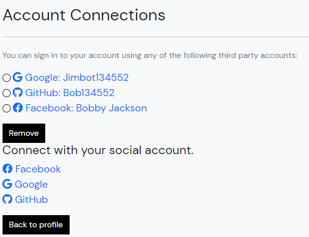

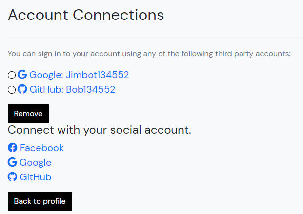

- Not having either selected refreshes the page.
- Clicking on either the Facebook, Google or GitHub button attempts to connect the users account to their selected social account.

### Change Password page

- Submitting a blank form notifies the user that there are inputs missing.
- Submitting incorrect original password notifies the user that their current password is incorrect.
- Submitting with mismatching new and repeat password notifies the user that the passwords do not match.
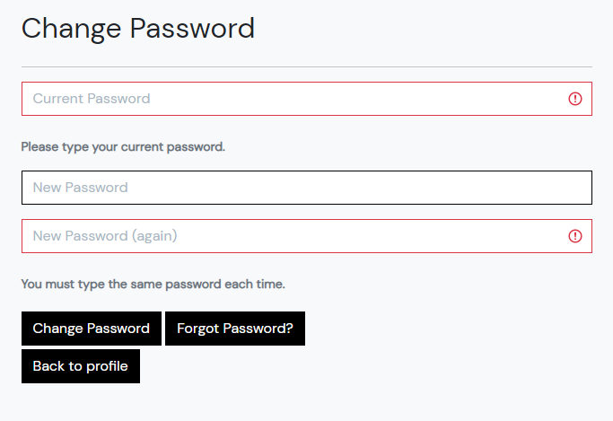

### Change Email page

- Attempting to remove a primary email if it is the only email available notifies the user that at least one email is required.
- Attempting to add an email with an empty input field notfies the user that the field is empty.
- Attempting to submit an email already registered notifies the user that the email is already associated to an account.

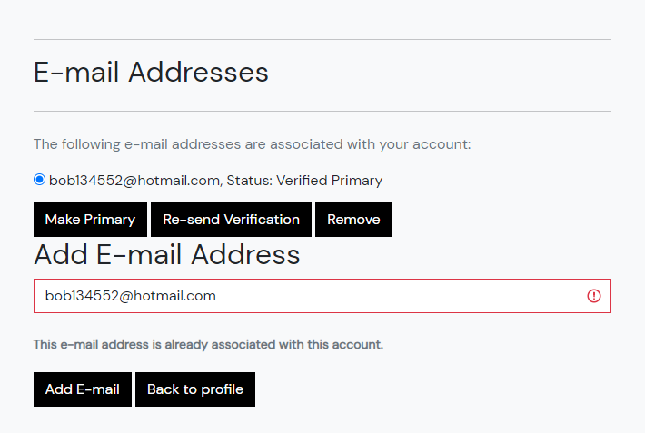

### Password Reset page

- Attempting to submit a blank field notifies the user that an input is required.
- Attempting to submit an email not linked to the account notifies the user that it isn't an email assigned their account.

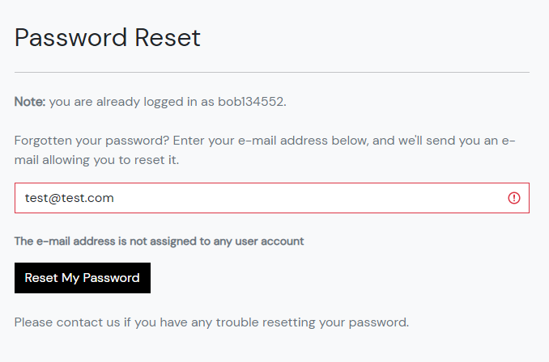

### Problems and bugs encountered.

- Facebook log in is only available for test accounts on the site.
    - Fixed following: https://stackoverflow.com/questions/65503880/developer-facebook-com-asks-for-data-deletion-url/65508332
    - Add policy page to both the deletion instruction url allows Facebook log in to be live.

- Due to using bootstrap5 crispy forms did not work.
    - This problem was fixed by pip3 installing crispy-bootstrap5 and specifying CRISPY_TEMPLATE_PACK and CRISPY_ALLOWED_TEMPLATE_PACKS to "bootstrap5".